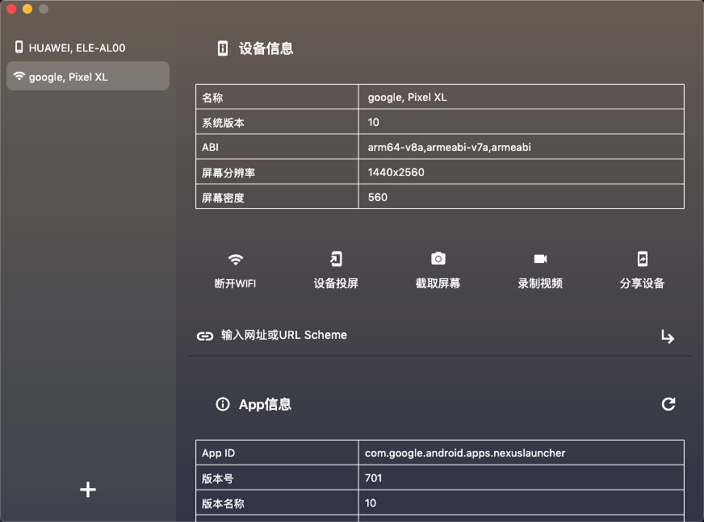
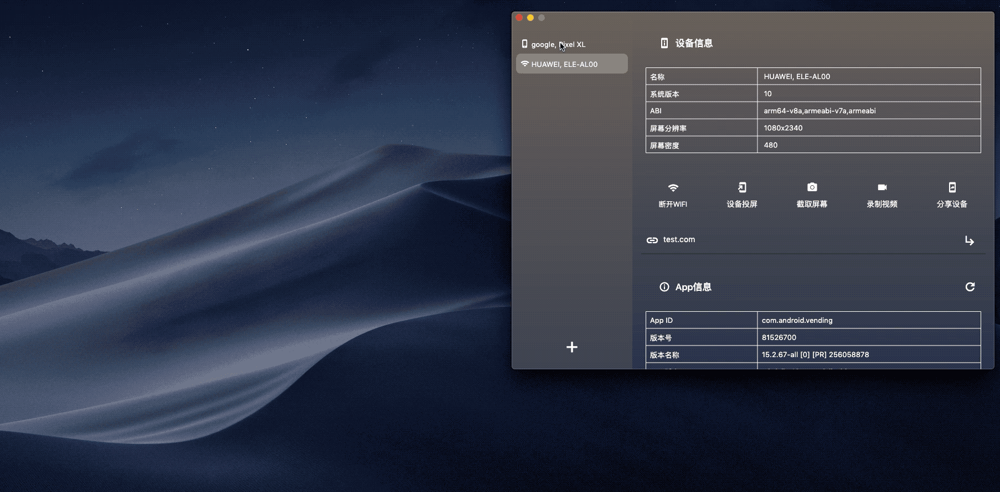
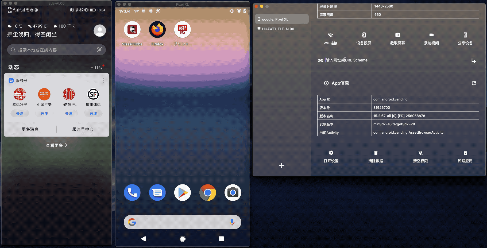

# AndroidPhoneHelper
一款辅助操作Android手机的桌面应用，支持macOS、Windows、Linux。

目前功能完善的为macOS版本，Windows、linux版本还未适配完成。

## 1.功能列表

- 连接的设备信息
- WIFI连接设备
- 设备投屏
- 截屏、录屏
- 输入网址，Url Scheme 快速打开App
- 设备当前的App信息
- 快速打开App设置页面
- 清除App数据
- 一键清空App权限
- 卸载应用
- 投屏条件下支持 拖拽APK文件至投屏区域安装App，复制文件至手机内存。

## 2.演示示例
### 2.1 应用主界面



### 2.2 设备投屏



### 2.3 快速使用手机打开网页、UrlScheme测试



## 3.项目说明

Flutter Desktop Support：https://flutter.dev/desktop

项目中用到的设备投屏库为Scrcpy：https://github.com/Genymobile/scrcpy

### 3.1 Flutter如何支持桌面版本
切换channel
```
flutter channel dev
flutter upgrade
```
开启桌面支持

```
 flutter config --enable-windows-desktop
 flutter config --enable-macos-desktop
 flutter config --enable-linux-desktop
```
检测运行环境
```
flutter doctor
```

### 3.2 运行与打包桌面应用
运行
```
 flutter run -d windows
 flutter run -d macos
 flutter run -d linux
```

打包
```
 flutter build windows
 flutter build macos
 flutter build linux
```


```
adb shell pm path com.xflag.store.staging.debug
adb pull /data/app/com.xflag.store.staging.debug-F20YtLzUnSDbqfwjAnI-TA==/base.apk /Users/wangwen/Desktop/
```